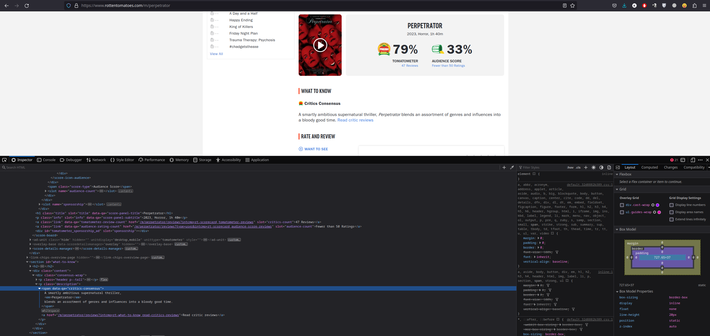

# Movie Scraping Script

## Table of Contents

1. [Introduction](#introduction)
2. [Installation](#installation)
3. [How To Use](how-to-use)
4. [Script Explanation](#script-explanation)
5. [Example Output](#example-output)

## Introduction

This documentation provides an overview of a Python script for scraping movie information from the `Rotten Tomatoes website`'s top movies" list and saving the data to an Excel file. The script uses the `requests` library for making HTTP requests, `BeautifulSoup` for parsing HTML content, and `xlwt` for creating Excel files.

## Installation

Before using the script, you need to install the required Python libraries if you haven't already. You can install them using pip:

```bash
pip install requests
pip install beautifulsoup4
pip install xlwt

```

## How To Use

```bash
git clone https://github.com/KhondokerTanvirHossain/web-crarwler-python.git

cd web-crarwler-python

python3 Crawler.py 
```

The script will scrape data from Rotten Tomatoes and save it to an Excel file named movies_top100.xls.

## Script Explanation

We need to get the name and link of the top100 movies. We noticed that the name of the movie needed is under. After extracting the page content using BeautifulSoup, we can use the find method to extract the relevant information.



The BeautifulSoup library has three methods to find elements:

    1. findall() :find all nodes
    2. find() :find a single node
    3. select() :finds according to the selector CSS Selector

As an example, we can find a span with attribute data-qa like this

```python
movie_review = movie_soup.find('span', {
        'data-qa': 'critics-consensus'
    }).getText().strip()
```

* To begin, you should include the necessary libraries that you'll be working with.

```python
import requests
from bs4 import BeautifulSoup
from xlwt import *
```

* Create a URL address that needs to be crawled, then create the header information, and then send a network request to wait for a response.When requesting access to the content of a webpage, sometimes you will find that a 403 error will appear. This is because the server has rejected your access. This is the anti-crawler setting used by the webpage to prevent malicious collection of information. At this time, you can access it by simulating the browser header information.

```python
url = "https://www.rottentomatoes.com/top/bestofrt/"
headers = {
  'User-Agent': 'Mozilla/5.0 (Windows NT 6.1; WOW64) AppleWebKit/537.36 (KHTML, like Gecko) Chrome/63.0.3239.132 Safari/537.36 QIHU 360SE'
}
f = requests.get(url, headers = headers)
```

* In the if __name__ == '__main__': block, the script initializes the necessary variables, sends HTTP requests to Rotten Tomatoes, and scrapes data for movie name and links.


* To extract movie names and construct URLs for each movie,the process involves finding all span elements marked with the p--small attribute. Subsequently, for each of these elements, the script fetches the respective movie's URL to access detailed information about it.

```python
soup = BeautifulSoup(f.content, 'lxml')
blocks = soup.find_all('span', {
    'class': 'p--small'
})
for block in blocks:
    movie_name = block.getText().strip()
    movie_url = 'https://www.rottentomatoes.com/m/' + movie_name.replace(' ', '_').lower()
    movie_f = requests.get(movie_url, headers=headers)
```

* func_movie_content, func_movie_content and func_movie_review This function extracts the movie's content, information and review from the HTML content.

```python
def func_movie_content(movie_soup):
    movie_content_soup = movie_soup.find('p', {
        'data-qa': 'movie-info-synopsis'
    })
    if movie_content_soup is None:
        return "404 NOT FOUND!"
    else:
        return movie_content_soup.getText().strip()
```

* It then sends HTTP requests to Rotten Tomatoes for each movie and scrapes data including category, introduction and review.

```python
    movie_soup = BeautifulSoup(movie_f.content, 'lxml')
    movie_content = func_movie_content(movie_soup)
    movie_review = func_movie_review(movie_soup)
    movie_category = func_movie_category(movie_soup)

```

* Before writing the collected data into an Excel file, workbook and table need to be initialized
Then writes the collected data to an Excel file, including movie number, name, URL, category, introduction, and review.

```python
    table.write(line, 0, num)
    table.write(line, 1, movie_name)
    table.write(line, 2, movie_url)
    table.write(line, 3, movie_category)
    table.write(line, 4, movie_content)
    table.write(line, 5, movie_review)
workbook.save('movies_top100.xls')
```

### Example Output

Once the script is executed, it will create an Excel file (movies_top100.xls) with a table containing Number, Name, URL, Information, Introduction, Review


Each row in the table represents a movie from the Rotten Tomatoes "Top 100 Movies" list, with the corresponding data collected during the scraping process.
